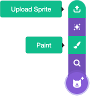
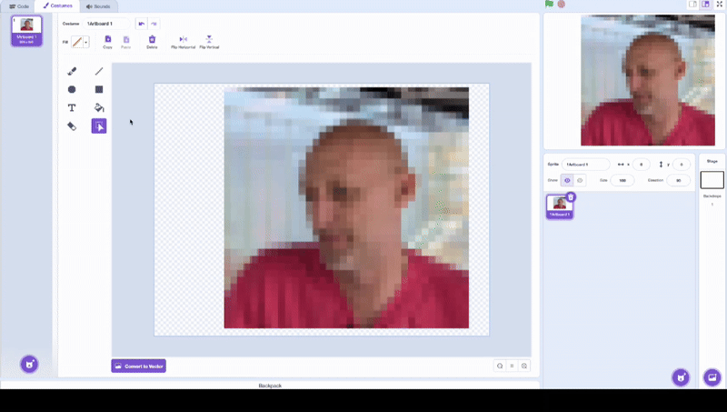
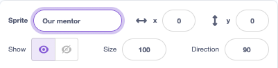

## Add a sprite

--- task ---

Open the starter project at [rpf.io/scratch-frame](http://rpf.io/scratch-frame)

--- /task ---

You need an image that represents **you or your club**.
It could be:
- your favorite team's mascot
- a picture of your pet
- a photo of your club room. 

**If you are using a photo, then make sure there is nothing in the image that could identify you. You could use [ResizePixel](https://www.resizepixel.com/) to pixelate a photo.**

--- task ---

Paint a picture or upload an image.

--- /task ---

--- task ---

Resize and position the image so that if fits inside the black frame on the stage.

--- /task ---

--- task ---

Rename the sprite.

--- /task ---

