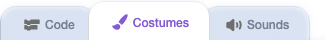
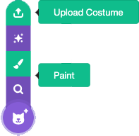
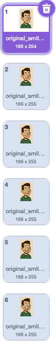
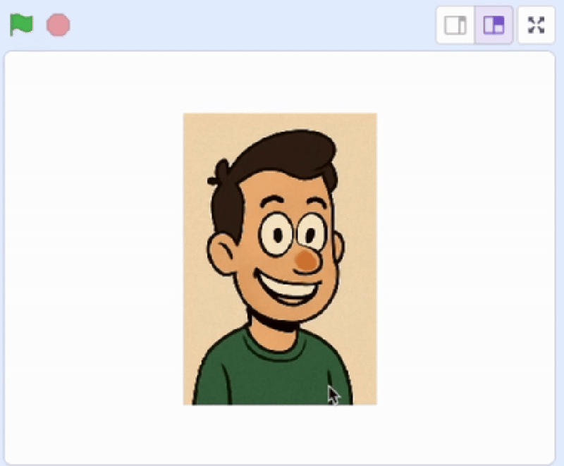
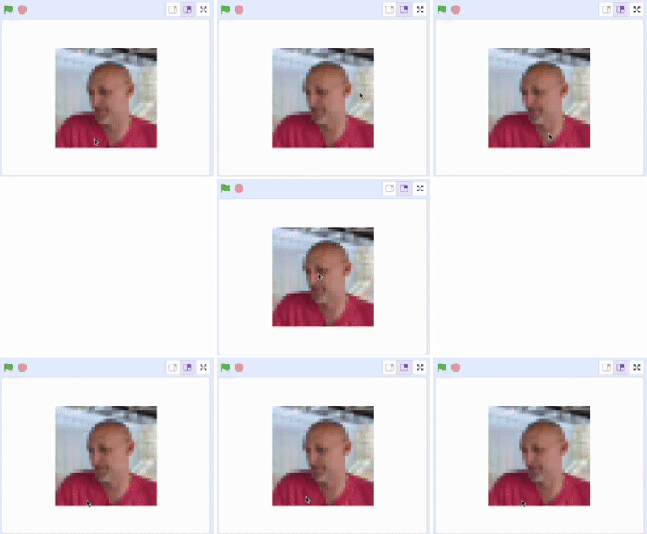
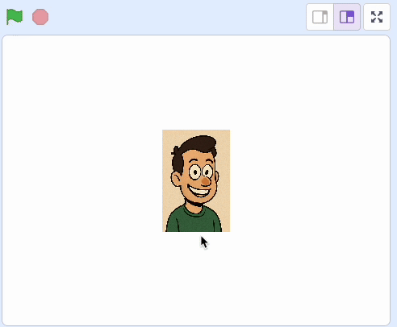
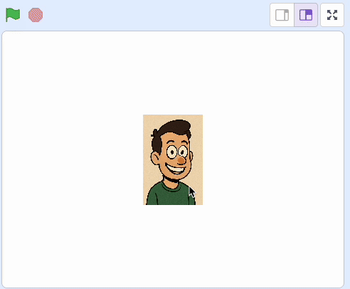

## Animate

--- task ---

Click on the boxes below to animate your sprite. You can use costume changes, `graphic effects`{:class="block3looks"}, `Motion`{:class="block3motion"}, or a mixture of the three.

--- /task ---

--- collapse ---

---

title: Animate with costumes

---

With multiple images you can change costumes to animate a sprite.

--- task ---

Click on the **Costumes** tab for the sprite.

)

--- /task ---

--- task ---

Upload or paint a second costume.



--- /task ---

--- task ---

Add more costumes as needed.



--- /task ---

--- task ---

Add code to the sprite to change costumes.

```blocks3
when this sprite clicked
go to [front v] layer
switch costume to (1 v)
repeat (5)
wait (0.2) seconds
next costume
end
```


--- /task ---

--- /collapse ---

--- collapse ---

---

title: Animate with graphic effects

---

There are seven different graphic effects in Scratch. You can use as many as you like.

--- task ---

Choose a graphic effect, and change its value in a `repeat`{:class="block3control"}.

```blocks3
when this sprite clicked
clear graphic effects
repeat (10)
change [fisheye v] effect by (25)
wait (0.2) seconds
```
 
 

--- /task ---

--- task ---

Change:
1. The number of repeats
2. The value of the effect
3. The `wait`{:class="block3control"} time

```blocks3
when this sprite clicked
clear graphic effects
repeat (15)
change [fisheye v] effect by (12)
wait (0.1) seconds
end
```

--- /task ---

--- task ---

Try mixing effects together.

```blocks3
when this sprite clicked
clear graphic effects
repeat (15)
change [fisheye v] effect by (12)
change [mosaic v] effect by (4)
wait (0.1) seconds
end
```

--- /task ---

--- /collapse ---

--- collapse ---

---

title: Animate with Motion

---

The sprite could move around the screen using `move`{:class="block3motion"}, `glide`{:class="block3motion"}, and `rotate`{:class="block3motion"}.

--- task ---

Add code to make the sprite move.

```blocks3
when this sprite clicked
go to x: (0) y: (0)
point in direction (90)
repeat (50)
move (20) steps
wait (0.01) seconds
if on edge, bounce
end
```



--- /task ---

You could use `pick random`{:class="block3operators"} to turn the sprite a random value, or `wait`{:class="block3control"} for different times.



--- /collapse ---

You can mix up all the animation types together.

